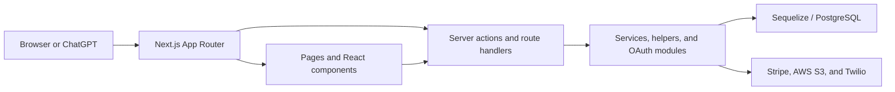

# Project Overview

- Last updated: 2026-06-30

## What the application does

Milkywayy is a booking and delivery platform for real estate media services.
Customers can select services such as photography, videography, and 360-degree
tours, schedule a shoot, pay, and manage the resulting booking and deliverable
files. Staff use the admin portal to operate the booking lifecycle, configure
commercial data, and publish customer deliverables.

## Product areas

### Public website and booking

- The landing page, portfolio, reviews, pricing, and contact surfaces introduce
  the service and show completed work.
- The booking flow collects property and service details, calculates pricing,
  checks scheduling availability, and starts Stripe checkout.
- Stripe webhook handling finalizes payment-related booking state.

Start with [the public app](../src/app/page.js),
[landing components](../src/components/landing/), and
[the booking route](../src/app/booking/).

### Customer authentication and dashboard

- Customers authenticate by phone OTP and receive a signed HTTP-only session
  cookie.
- The dashboard exposes bookings, delivery files, invoices, and connected
  applications. Wallet code also exists, although its dashboard tab is
  currently hidden.
- Route-level access and role redirects are enforced by
  [`src/proxy.js`](../src/proxy.js), with additional ownership checks in server
  actions and route handlers.

Start with [customer authentication](../src/lib/services/customerAuth.js),
[session helpers](../src/lib/helpers/auth.js), and
[dashboard routes](../src/app/dashboard/).

### Admin operations

The admin portal supports booking operations, deliverable uploads, users,
pricing, coupons, discounts, invoices, time slots, reviews, and portfolio
content. Pages live under [`src/app/admin/`](../src/app/admin/); JSON and upload
endpoints live under [`src/app/api/admin/`](../src/app/api/admin/).

### Delivery workflow

Confirmed bookings move through shoot, editing, file upload, customer review,
revision, and completion states. Deliverables are versioned per file, review
allowances are tracked, and eligible files/bookings are completed by a scheduled
worker.

The main implementation is in
[`bookingWorkflow.js`](../src/lib/services/bookingWorkflow.js),
[`fileDelivery.js`](../src/lib/services/fileDelivery.js), and
[`bookingUpload.js`](../src/lib/services/bookingUpload.js). Persistence is
defined by the booking delivery models and migrations under
[`src/lib/db/`](../src/lib/db/).

### GPT Actions and OAuth

Milkywayy implements an OAuth 2.0 authorization-code flow for a ChatGPT Custom
GPT. The connected GPT receives customer-scoped, read-only access to account,
booking, invoice, and delivery-file metadata. It does not receive direct file
contents or write access.

OAuth routes are under [`src/app/oauth/`](../src/app/oauth/), protocol logic is
under [`src/lib/oauth/`](../src/lib/oauth/), and resource endpoints are under
[`src/app/api/gpt/v1/`](../src/app/api/gpt/v1/). See the
[feature documentation](./gpt-actions-oauth/README.md) for the protocol,
security, operations, and verification details.

## Architecture

- Pages and layouts in `src/app/` define the public, customer, admin, OAuth,
  and API boundaries.
- Reusable UI is in `src/components/`; domain-aware mutations and queries are
  primarily in `src/lib/actions/` and `src/lib/services/`.
- Sequelize models, associations, migrations, and seeders are in `src/lib/db/`.
- Cross-cutting authentication, pricing, invoice, workflow, validation, storage,
  notifications, and security logging code is grouped under `src/lib/`.
- Background workers call protected internal API routes rather than duplicating
  lifecycle logic.

## Code map

| Path | Responsibility |
|---|---|
| [`src/app/`](../src/app/) | App Router pages, layouts, route handlers, and feature-local components. |
| [`src/components/`](../src/components/) | Shared customer, admin, landing-page, portfolio, and UI components. |
| [`src/lib/actions/`](../src/lib/actions/) | Server actions for bookings, users, authentication, pricing-related data, wallet, and notifications. |
| [`src/lib/services/`](../src/lib/services/) | Domain workflows for customer authentication, delivery, uploads, and booking completion. |
| [`src/lib/db/`](../src/lib/db/) | PostgreSQL connection, Sequelize models, associations, migrations, and seeders. |
| [`src/lib/oauth/`](../src/lib/oauth/) | Framework-light OAuth protocol and security logic. |
| [`src/lib/storage/`](../src/lib/storage/) | S3 client configuration, signed URLs, and upload limits. |
| [`scripts/`](../scripts/) | Scheduled workers plus OAuth provisioning and verification utilities. |
| [`public/`](../public/) | Static images, policy content, and other public assets. |
| [`ecosystem.config.cjs`](../ecosystem.config.cjs) | PM2 process definitions for the web app and scheduled workers. |

Tests generally live in `__tests__` directories beside the code they cover.
Repository-wide health and known failures are recorded in
[`docs/PROJECT-STATUS.md`](./PROJECT-STATUS.md).

## Core data model

- `User` represents customers and staff roles.
- `Booking` belongs to a user and transaction and owns workflow, revision, and
  delivery records.
- `Transaction`, `WalletTransaction`, and `Coupon` represent payment and credit
  activity.
- `BookingDeliveryFile`, its versions, revisions, and upload sessions represent
  the deliverable lifecycle.
- `DynamicConfig` stores editable configuration such as pricing.
- `OurWork` and `Review` supply portfolio and social-proof content.
- OAuth clients, codes, tokens, consents, audit events, and rate limits are
  stored in dedicated OAuth models.

The model registry and associations are the fastest way to see the current
relationships: [`src/lib/db/models/index.js`](../src/lib/db/models/index.js) and
[`src/lib/db/relations.js`](../src/lib/db/relations.js).

## External integrations

| Integration | Purpose | Main code |
|---|---|---|
| PostgreSQL | Application persistence and durable OAuth state | [`src/lib/db/`](../src/lib/db/) |
| Stripe | Checkout, payment reconciliation, refunds, and webhooks | [`src/lib/actions/bookings.js`](../src/lib/actions/bookings.js), [`src/app/api/webhooks/stripe/`](../src/app/api/webhooks/stripe/) |
| AWS S3 / CloudFront | Portfolio assets, invoices, and delivery-file storage | [`src/lib/storage/s3.js`](../src/lib/storage/s3.js) |
| Twilio / WhatsApp | Customer OTP and booking notifications | [`src/lib/services/customerAuth.js`](../src/lib/services/customerAuth.js), [`src/lib/notifications/whatsapp.js`](../src/lib/notifications/whatsapp.js) |
| ChatGPT GPT Actions | Customer-authorized read-only API access | [`docs/gpt-actions-oauth/`](./gpt-actions-oauth/) |

For local setup and subsystem configuration, continue with the
[development guide](./DEVELOPMENT.md).
