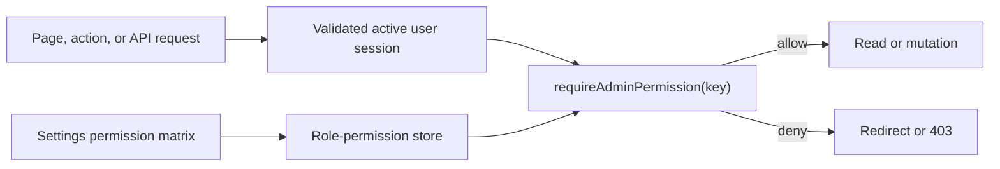

# Admin access control and Settings architecture

- Last updated: 2026-06-30

## Role model

The final user roles are:

- `SUPERADMIN`: immutable full administrative access.
- `ADMIN`: operational role with persisted section permission bundles.
- `ACCOUNTS`: finance role with persisted section permission bundles.
- `CUSTOMER`: no admin access.

Legacy `TRANSPORT` and `SHOOT` values are removed through a staged PostgreSQL
enum/data migration. Existing legacy staff rows are disabled for review before
activation under a new role; they are not automatically granted broader access.
The User default role becomes `CUSTOMER`.

## Permission model

Persist role-to-permission rows using stable permission keys. The Settings UI
shows section switches, while the backend expands sections to explicit read and
write capabilities such as:

- `dashboard.view`;
- `bookings.view`, `bookings.manage`, `bookings.deliver`;
- `calendar.view`, `calendar.manage`;
- `customers.view`, `customers.manage`;
- `invoices.view`, `invoices.export`;
- `reports.view`, `reports.export`, `expenses.manage`;
- `promotions.view`, `promotions.manage`;
- `timeslots.manage`, `pricing.manage`;
- `portfolio.manage`, `reviews.manage`;
- `settings.manage`.

Super Admin permission is code-enforced as full access and cannot be disabled by
database matrix edits. Admin and Accounts use persisted mappings with safe
defaults. Missing mappings deny access.

## Enforcement boundary

- Proxy performs coarse anonymous/customer/admin routing only.
- Server pages protect direct navigation.
- Every admin API and server action calls the central permission service.
- Client navigation uses the same permission snapshot only for presentation.
- Sensitive queries scope returned fields after permission checks.

## Staff Settings

Settings lists only staff roles and pending invitations. Users lists only
customers. Staff lifecycle operations include invite, resend, revoke,
activate/deactivate, and role change with last-Super-Admin protection.

## Invitation model and flow

Persist invitation email, intended role, random token hash, inviter, expiration,
send metadata, accepted/revoked timestamps, and status. Store no plaintext token.

1. Authorized Super Admin creates an invitation.
2. Server stores the token hash and sends the one-time link through an email
   provider adapter.
3. Recipient opens the link, token hash and expiry are verified, and credentials
   are established through the approved acceptance flow.
4. Acceptance activates one staff account and atomically consumes the token.
5. Resend revokes the prior token and issues a new one.

Provider credentials and exact live sender/domain configuration remain in
environment/private operational documentation.

## Audit model

Record actor, event type, target identifiers, safe before/after metadata,
request correlation, and timestamp for permission edits, invites, resend,
revoke, acceptance, role changes, and activation state. Never log tokens,
passwords, secrets, or full provider payloads.

## Migration sequence

1. Add new enum values and account-state support.
2. Seed permission mappings and central guard in compatibility mode.
3. Inventory and disable legacy-role rows for explicit review.
4. Migrate all code and routes to explicit permission checks.
5. Activate approved staff under `ADMIN` or `ACCOUNTS`.
6. Prove no legacy values/references remain.
7. Rebuild/remove PostgreSQL legacy enum values.
