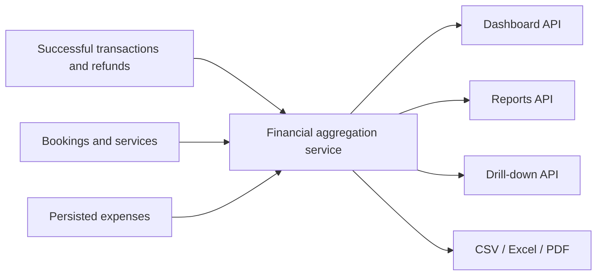

# Admin analytics and finance architecture

- Last updated: 2026-06-30

## Metric source of truth

All Dashboard, Reports, drill-down, and export values are produced by one
framework-light financial aggregation service. React components format results;
they do not calculate accounting metrics.

## Financial definitions

- Gross payments: successful transaction amounts whose `paidAt` falls in the
  selected business-time range.
- Refunds: transaction refunded amounts attributable to the selected range
  under the final refund-date policy defined by FIN-002.
- Net revenue: gross payments minus refunds.
- Expenses: non-deleted expense amounts whose expense date falls in range.
- Net profit: net revenue minus expenses.
- Completed bookings: bookings completed in range; this is operational and does
  not determine revenue recognition.
- Average booking value: net paid amount divided by included paid bookings,
  with a documented zero-denominator result.
- Outstanding: explicit balance due on non-cancelled admin-created or payable
  bookings; customer checkout drafts are excluded.
- Lost value: quoted value of cancelled bookings, shown separately and never
  added to revenue.

## Service revenue

Use the persisted booking/service price breakdown when available. Amounts that
cannot be attributed without guessing are grouped as `Unallocated`; they are
not divided evenly or assigned to the first service.

## Expense model

The first-release Expense record contains:

- amount in AED using a fixed-precision decimal;
- business expense date;
- category from a validated configured set;
- optional description;
- creator/updater identifiers and timestamps;
- soft-delete actor, reason, and timestamp.

The UI calls deletion, but storage retains an audit-safe soft-deleted record.

## APIs

- Dashboard summary: bounded date range, comparison period, KPIs, trends,
  service split, schedule summary, and recent bookings.
- Financial report: month/range filters, KPIs, weekly/monthly series, P&L, and
  booking-status data.
- Drill-down: metric key, same filters, pagination, stable sorting, and total.
- Expense CRUD: permission-checked list/create/update/soft-delete.
- Exports: validated report filter plus format; generated from the same report
  dataset and permission context.

Date ranges have maximum sizes. Drill-down rows are paginated. Queries use
database aggregation and indexes instead of loading all records into Node.js.

## Exports

- CSV uses stable UTF-8 columns and neutralizes spreadsheet formulas.
- Excel preserves numeric/date types, filter metadata, and totals.
- PDF includes generation time, business timezone, selected filters, totals,
  and readable tables/charts.

Exports must not contain fields absent from the authorized on-screen dataset.

## Time and currency

AED is the reporting currency for this release. Business ranges are interpreted
in `Asia/Dubai`; stored instants remain UTC. Range endpoints use explicit
inclusive/exclusive semantics to prevent double counting.
