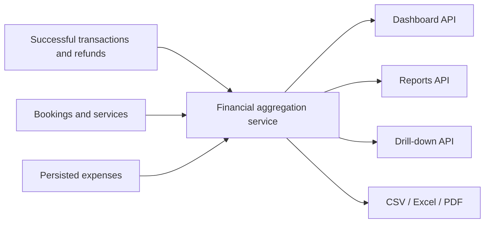

# Admin analytics and finance architecture

- Last updated: 2026-07-01

## Metric source of truth

All Dashboard, Reports, drill-down, and export values are produced by one
framework-light financial aggregation service. React components format results;
they do not calculate accounting metrics.

## Financial definitions

- Gross payments: successful transaction amounts whose `paidAt` falls in the
  selected business-time range.
- Refunds: transaction refunded amounts whose refund occurrence timestamp falls
  in the selected business-time range.
- Net revenue: gross payments minus refunds.
- Expenses: non-deleted expense amounts whose expense date falls in range.
- Net profit: net revenue minus expenses.
- Completed bookings: bookings completed in range; this is operational and does
  not determine revenue recognition.
- Average booking value: net paid amount divided by included paid bookings,
  with a documented zero-denominator result.
- Outstanding: explicit balance due on non-cancelled admin-created or payable
  bookings; customer checkout drafts are excluded.
- Lost value: quoted value of cancelled bookings, shown separately and never
  added to revenue.

## Service revenue

Use the persisted booking/service price breakdown when available. Amounts that
cannot be attributed without guessing are grouped as `Unallocated`; they are
not divided evenly or assigned to the first service.

## Expense model

The first-release Expense record contains:

- amount in AED using a fixed-precision decimal;
- business expense date;
- category from a validated configured set;
- optional description;
- creator/updater identifiers and timestamps;
- soft-delete actor, reason, and timestamp.

The UI calls deletion, but storage retains an audit-safe soft-deleted record.

## APIs

- Dashboard summary: bounded date range, comparison period, KPIs, trends,
  service split, schedule summary, and recent bookings.
- Financial report: month/range filters, KPIs, weekly/monthly series, P&L, and
  booking-status data.
- Drill-down: metric key, same filters, pagination, stable sorting, and total.
- Expense CRUD: permission-checked list/create/update/soft-delete.
- Exports: validated report filter plus format; generated from the same report
  dataset and permission context.

Date ranges have maximum sizes. Drill-down rows are paginated. Queries use
database aggregation and indexes instead of loading all records into Node.js.

## Exports

- CSV uses stable UTF-8 columns and neutralizes spreadsheet formulas.
- Excel preserves numeric/date types, filter metadata, and totals.
- PDF includes generation time, business timezone, selected filters, totals,
  and readable tables/charts.

Exports must not contain fields absent from the authorized on-screen dataset.

## Time and currency

AED is the reporting currency for this release. Business ranges are interpreted
in `Asia/Dubai`; stored instants remain UTC. Range endpoints use explicit
inclusive/exclusive semantics to prevent double counting.

## Common reporting semantics

- Every report range is normalized in `Asia/Dubai`, then applied to stored UTC
  timestamps as `[rangeStart, rangeEnd)`.
- Comparison cards always use the immediately preceding contiguous period with
  the same duration as the active range.
- Financial amounts are summed at storage precision and rounded only when the
  API serializes the final response.
- Empty amount metrics return `0.00`; empty counts return `0`; empty ratios and
  percentages return `0`; empty charts still return the requested zero-filled
  buckets; empty lists return `[]`.
- Drill-down totals must reconcile exactly to the aggregate metric that opened
  the drill-down, using the same date basis and filters.

## Shared filter and export contract

Every analytics surface accepts one canonical validated filter object. Dashboard
cards, Financial Reports, drill-downs, CSV, Excel, and PDF exports may layer
surface-specific options on top of that object, but they may not reinterpret
date boundaries, silently widen scope, or add hidden server-only filters.

### Canonical filter fields

| Field | Required | Contract |
|---|---|---|
| `rangeStart` | Yes | Inclusive lower bound. Accept an ISO 8601 timestamp or a date-only `YYYY-MM-DD` value; date-only input is normalized to the start of that Dubai business day. |
| `rangeEnd` | Yes | Exclusive upper bound. Accept an ISO 8601 timestamp or a date-only `YYYY-MM-DD` value; date-only input is normalized to the start of the following Dubai business day so every request remains `[rangeStart, rangeEnd)`. |
| `timezone` | No | Defaults to `Asia/Dubai`. If supplied, it must equal `Asia/Dubai`; first release does not support caller-selected reporting timezones. |
| `comparisonMode` | No | Only `previous_period` is valid. Omitted means comparison is still derived as the immediately preceding contiguous period with the same duration. |
| `serviceKey` | No | Canonical service slug from the pricing configuration, or `unallocated` for value that cannot be attributed exactly. Unsupported values are rejected. |
| `bookingStatusBucket` | No | One of the documented report buckets: `pending`, `completed`, `cancelled`, or `all`. Raw workflow states are not accepted as filter input. |
| `expenseCategory` | No | Canonical configured expense-category slug. Deleted or unknown categories are rejected rather than treated as no-op filters. |
| `groupBy` | No | Only `day`, `week`, or `month`. Each endpoint further narrows which groupings it accepts. |
| `metricKey` | No | Required for drill-down requests. Must reference a metric explicitly documented in this feature contract; arbitrary SQL/report column names are never accepted from clients. |
| `page` | No | Drill-down only. Integer `>= 1`. Omitted defaults to `1`. |
| `pageSize` | No | Drill-down only. Integer `1-100`. Omitted defaults to `25`. |
| `sortKey` | No | Drill-down only. Must be selected from a per-metric allowlist documented by the API response metadata. |
| `sortDirection` | No | Drill-down only. `asc` or `desc`; omitted uses the metric's default stable sort. |

### Validation and normalization rules

- Reject requests missing `rangeStart` or `rangeEnd`.
- Reject ranges where the normalized end is not after the normalized start.
- Reject normalized ranges wider than `366` Dubai business days.
- Normalize all date-only input before database access; do not let each query
  path interpret raw strings independently.
- Treat omitted optional filters and explicit `null` values identically.
- Reject unknown filter keys so exports and drill-downs cannot smuggle
  unreviewed query behavior into the aggregation layer.
- Canonicalize every accepted request into a normalized server object that is
  reused unchanged by screen APIs, drill-down queries, and export jobs.

### Surface overlays

| Surface | Allowed overlay fields | Additional contract |
|---|---|---|
| Dashboard summary API | `comparisonMode` | Summary responses use the canonical range and comparison period only. Pagination, sort, `metricKey`, and export-format inputs are invalid. |
| Financial report API | `comparisonMode`, `serviceKey`, `bookingStatusBucket`, `expenseCategory`, `groupBy` | `groupBy` is limited to `week` and `month` for report charts. The KPI strip, charts, breakdowns, and P&L all read from the same normalized filter object. |
| Drill-down API | `metricKey`, `serviceKey`, `bookingStatusBucket`, `expenseCategory`, `page`, `pageSize`, `sortKey`, `sortDirection` | The drill-down must use the exact same normalized base filters as the card or report section that opened it. Only one documented metric domain may be drilled at a time. |
| Export API | Same filter fields as the source Dashboard/Report/Drill-down view plus `format` in `{csv,xlsx,pdf}` | Export jobs reuse the caller's normalized filter object exactly. They may not request a wider range, a different comparison mode, extra hidden columns, or an alternate dataset version. |

### Export equivalence rules

- CSV, Excel, and PDF exports must embed the normalized date range, timezone,
  and any optional filter labels visible on screen.
- Export totals, bucket counts, and drill-down rows must reconcile to the same
  normalized request that rendered the UI state the operator exported.
- When a screen launches an export from a drill-down, the export inherits the
  active `metricKey`, pagination-off row scope, and sort order unless the
  format explicitly documents a different full-result export mode.
- Export filenames and audit events should store the same normalized filter
  payload used for generation so reconciliation does not depend on browser state.

## Dashboard metric contract

| Metric | Formula and date basis | Source fields | Filters | Empty behavior |
|---|---|---|---|---|
| Gross payments | `SUM(transactions.amount)` where `transactions.status = success` and `transactions.paidAt` falls in the active Dubai-normalized range | `transactions.amount`, `transactions.status`, `transactions.paid_at` | Active date range | `0.00` |
| Refunds | `SUM(transactions.refundedAmount)` for refund events whose occurrence timestamp falls in the active Dubai-normalized range | `transactions.refunded_amount`, `transactions.metadata.lastRefund.refundedAt`, `transactions.paid_at` | Active date range | `0.00` |
| Net revenue | Gross payments minus refunds for the same range | Gross-payment and refund inputs above | Active date range | `0.00` |
| Expenses | `SUM(expenses.amount)` where `expenses.deletedAt IS NULL` and `expenses.expenseDate` falls in range | `expenses.amount`, `expenses.expense_date`, `expenses.deleted_at` | Active date range and optional expense category drill-down | `0.00` |
| Net profit | Net revenue minus expenses for the same range | Net revenue and expense inputs above | Active date range | `0.00` |
| Completed bookings | `COUNT(bookings.id)` where the booking is in a completed terminal state and `bookings.completedAt` falls in range | `bookings.status`, `bookings.workflow_status`, `bookings.completed_at` | Active date range | `0` |
| Pending bookings | `COUNT(bookings.id)` where the booking is not cancelled, not completed, and its scheduled shoot date falls in range | `bookings.status`, `bookings.workflow_status`, `bookings.date`, `bookings.start_time` | Active date range | `0` |
| Cancelled bookings | `COUNT(bookings.id)` where `bookings.cancelledAt` falls in range | `bookings.status`, `bookings.cancelled_at` | Active date range | `0` |
| Lost value | `SUM(bookings.total)` for cancelled bookings whose `cancelledAt` falls in range; this never contributes to revenue | `bookings.total`, `bookings.cancelled_at`, `bookings.status` | Active date range | `0.00` |
| Average booking value | Net revenue divided by the count of paid bookings whose successful payment falls in range | Net revenue inputs plus `bookings.transaction_id`, `transactions.status`, `transactions.paid_at` | Active date range | `0.00` |
| Outstanding balance | `SUM(MAX(bookings.total - bookings.paidAmount, 0))` for non-cancelled payable bookings in range; customer checkout drafts are excluded | `bookings.total`, `bookings.paid_amount`, `bookings.status`, `bookings.cancelled_at`, `bookings.date` | Active date range | `0.00` |
| Revenue trend | Net revenue bucketed by Dubai business month, week, or day depending on the selected Dashboard preset | Net revenue inputs above | Active date range and requested bucket size | Return every requested bucket with zero values when no data exists |
| Revenue by service | Sum the persisted booking service line amounts for paid bookings in range. If the service allocation cannot be derived exactly from the booking pricing inputs, place that amount in `Unallocated` rather than guessing. | `bookings.total`, `bookings.property_details`, `bookings.shoot_details`, pricing configuration used by `buildBookingInvoiceItems`, `transactions.paid_at`, `transactions.status` | Active date range and optional service drill-down key | Return `[]` when no attributable services exist |
| Schedule summary | Counts of bookings grouped by scheduled shoot day and workflow bucket using the booking shoot date, not payment date | `bookings.date`, `bookings.start_time`, `bookings.status`, `bookings.workflow_status` | Active date range | Return zero-count day buckets and `[]` for recent-day details |
| Recent bookings | Most recently created non-draft bookings that intersect the active date range, ordered by `createdAt DESC` and capped by the Dashboard page size | `bookings.id`, `bookings.booking_code`, `bookings.created_at`, `bookings.status`, `bookings.total`, `bookings.date`, joined customer identity fields | Active date range, page size, and optional status drill-down | `[]` |

## Financial report metric contract

| Report output | Formula and date basis | Source fields | Filters | Empty behavior |
|---|---|---|---|---|
| KPI strip | Reuses the Dashboard definitions for gross payments, refunds, net revenue, expenses, net profit, completed bookings, average booking value, and lost value | Same as the Dashboard contract | Active report date range | Zero/empty values match the Dashboard contract |
| Weekly trend chart | Net revenue grouped by Dubai business week using payment date for successful payments and refund occurrence date for refunds | `transactions.amount`, `transactions.refunded_amount`, `transactions.paid_at`, `transactions.metadata.lastRefund.refundedAt`, `transactions.status` | Active report date range | Return every requested week bucket with zero values |
| Six-month trend chart | Net revenue grouped into the six Dubai business months ending with the selected report month | Same as weekly trend plus month bucket generation | Selected report month or explicit report range | Return six zero-valued month buckets when no data exists |
| Booking status breakdown | Counts of bookings grouped by reporting bucket: scheduled and pending states by `bookings.date`, completed by `bookings.completedAt`, cancelled by `bookings.cancelledAt` | `bookings.status`, `bookings.workflow_status`, `bookings.date`, `bookings.completed_at`, `bookings.cancelled_at` | Active report date range and optional status key | Return zero-valued buckets for every supported status group |
| Service revenue breakdown | Same service-allocation rule as the Dashboard, including mandatory `Unallocated` handling for non-reconstructable value | Same as Dashboard service revenue | Active report date range and optional service key | `[]` |
| Monthly comparison table | One row per Dubai business month containing gross payments, refunds, net revenue, expenses, net profit, completed bookings, cancelled bookings, lost value, and average booking value | Same as the Dashboard contract, grouped by Dubai month | Requested month window | Return the requested month rows with zero-filled values |
| Profit and loss summary | Net revenue, expenses, profit, and margin where `margin = profit / net revenue` when net revenue is positive, otherwise `0` | Net revenue and expense inputs above | Active report date range | Monetary values `0.00`, margin `0` |

## Filter expectations for metric implementation

- `rangeStart` and `rangeEnd` are required for every Dashboard and Reports
  request, even when the UI starts from a month preset.
- Metrics may add optional drill-down selectors such as service key, booking
  status bucket, page, and page size, but they may not reinterpret the
  underlying date basis in the browser.
- The shared validated request schema above is the source of truth for screen
  APIs, drill-downs, and exports.
