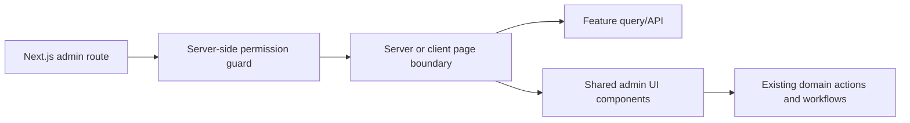

# Admin panel UI refresh architecture

- Last updated: 2026-06-30

## Boundary

This feature owns presentation, route composition, and interaction layout. It
does not own financial formulas, scheduling rules, permissions, or booking
workflow behavior.

## Route structure

- Keep existing URL-based Next.js routes; do not reproduce the prototype's
  in-memory page switcher.
- The authenticated admin layout owns the sidebar, mobile navigation, header,
  breadcrumb, and page content frame.
- The login route uses a separate unauthenticated layout and never renders the
  authenticated sidebar or logout action.
- Navigation items come from a typed route registry containing section,
  label, icon, href, and required permission.

## Shared UI layer

Create reusable components for:

- page headers and actions;
- KPI cards and comparison badges;
- status and service badges;
- tables, filter bars, totals, loading rows, and empty/error states;
- responsive dialog/drawer details;
- charts and legends;
- confirmation and mutation feedback.

Components accept live data through props and must not contain prototype sample
records or financial calculations.

## Page integration boundaries

### Dashboard

Consumes one bounded Dashboard response from `admin-analytics-finance` and a
calendar summary from the same response or scheduling query. Drill-downs use
paginated server results instead of loading all bookings into the browser.

### Bookings

The visual list and detail hierarchy change, but the existing workflow actions,
delivery-file components, notification actions, invoice links, and revision
state remain wired to their current domain services.

### Invoices

Search state is URL-backed. The server filters by invoice number, booking
reference, and customer identity and returns the total for the filtered result.
Download URLs continue to use the existing secure invoice path.

### Portfolio and Reviews

Presentation wraps existing CRUD forms and mutations. Portfolio media filters
operate over server data without replacing drag ordering. Review quote preview
is added without removing feature, visibility, rating, or order controls.

## Responsive behavior

- Desktop uses a persistent grouped sidebar.
- Mobile uses an explicit menu/drawer, not a clipped permanent sidebar or a
  horizontally overflowing list of every route.
- Wide tables provide a deliberate compact/card fallback or horizontal scroll
  with pinned primary actions.
- Dialogs become full-height drawers where viewport height is constrained.

## Error and state handling

Every query surface defines loading, empty, forbidden, failed, and retry states.
Mutations use disabled/pending controls, stable confirmations, and success/error
feedback. Optimistic updates are allowed only where rollback is reliable.
