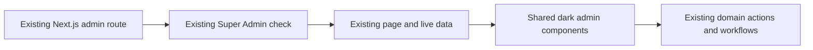

# Admin panel UI refresh architecture

- Last updated: 2026-07-20

## Boundary

This feature owns presentation, shell composition, list filtering, and content
ordering controls. It does not own financial formulas, scheduling rules,
promotion eligibility, authentication, or booking workflow behavior.

## Route and navigation contract

Existing URLs remain unchanged:

- Workspace: `/admin`, `/admin/bookings`, `/admin/scheduling-calendar`, `/admin/users`.
- Finance: `/admin/invoices`, `/admin/analytics`.
- Operations: `/admin/promotions`, `/admin/timeslots`, `/admin/prices`.
- Content: `/admin/portfolio`, `/admin/reviews`.
- Authentication: `/admin/login` retains its current structure and receives styling only.

`/admin/discounts` and `/admin/coupons` remain compatibility redirects to
`/admin/promotions`. No Settings destination is shown. Desktop uses a persistent
grouped sidebar; narrow screens use a menu-triggered drawer.

## Shared UI layer

Create or consolidate reusable styling for:

- page headers, descriptions, and actions;
- navigation groups, active states, header identity, and breadcrumbs;
- cards, KPI values, badges, tabs, filters, and search fields;
- tables, horizontal-scroll containers, totals, and empty/loading/error states;
- dialogs, forms, confirmation controls, and mutation feedback;
- charts and legends using live analytics data.

Components accept live data through props and contain no prototype sample records
or financial calculations.

## Page integration boundaries

### Dashboard and Reports

`/admin` consumes the bounded Dashboard response supplied by
`admin-analytics-finance`. `/admin/analytics` retains detailed reports, expense
management, drill-down, and export behavior. Shared calculations remain in the
analytics service.

### Bookings

Add All, Completed, Pending, and Cancelled filtering to the existing list. The
current detail dialog, workflow updates, notifications, invoice links, uploads,
versions, revisions, publishing, and completion controls remain wired to their
existing services. No New Booking control is added.

### Customers

The `/admin/users` route and current customer operations remain unchanged. Only
the visible label and presentation become Customers.

### Invoices

Search covers invoice number, booking reference, and customer identity. The
visible footer total reflects the filtered result. Existing secure invoice
download URLs remain unchanged.

### Promotions, Calendar, Time Slots, and Pricing

Promotions retains its three current tabs and dense reference table/form
composition. The operational month view and date-specific block controls exist
only at `/admin/scheduling-calendar`; `/admin/timeslots` edits rolling windows,
working days, named period definitions, and weight configuration without
rendering a second calendar. Pricing continues through its current save action
and marks changed cells plus affected property tabs until that action succeeds.

### Portfolio

Add media-type filters for All Works, Photography, Short Form Video, Long Form
Video, and 360 Virtual Tour. Existing create/edit/upload/delete/visibility and
drag-order behavior remain available. Filtering must not corrupt the persisted
global order. The table exposes an icon-only drag handle; numeric order values
remain internal persistence state.

### Reviews

Keep CRUD, visibility, rating, and featured controls. Add drag ordering within
the Featured and Standard groups and persist the resulting `order` values.
Featured reviews continue to sort before Standard reviews. Review ordering also
uses an icon-only handle without a visible order number or `DRAG` label. Do not
add a review preview column.

## Responsive behavior

- Desktop uses a persistent grouped sidebar.
- Mobile uses a menu-triggered drawer.
- Wide tables remain tables inside explicit horizontal-scroll containers.
- Actions must remain reachable by scrolling; the UI must not silently clip columns.
- Forms and dialogs may resize or scroll vertically without changing workflows.

## State handling

Retain or add clear loading, empty, failed, and mutation-pending states where the
affected page already performs asynchronous work. Optimistic reordering must
restore the prior order if persistence fails.
