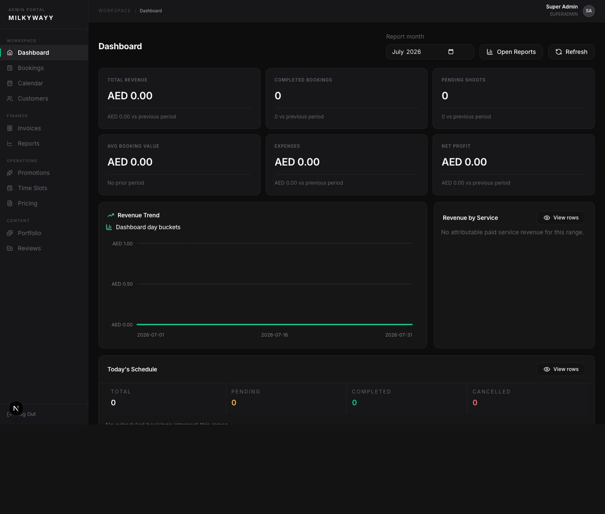
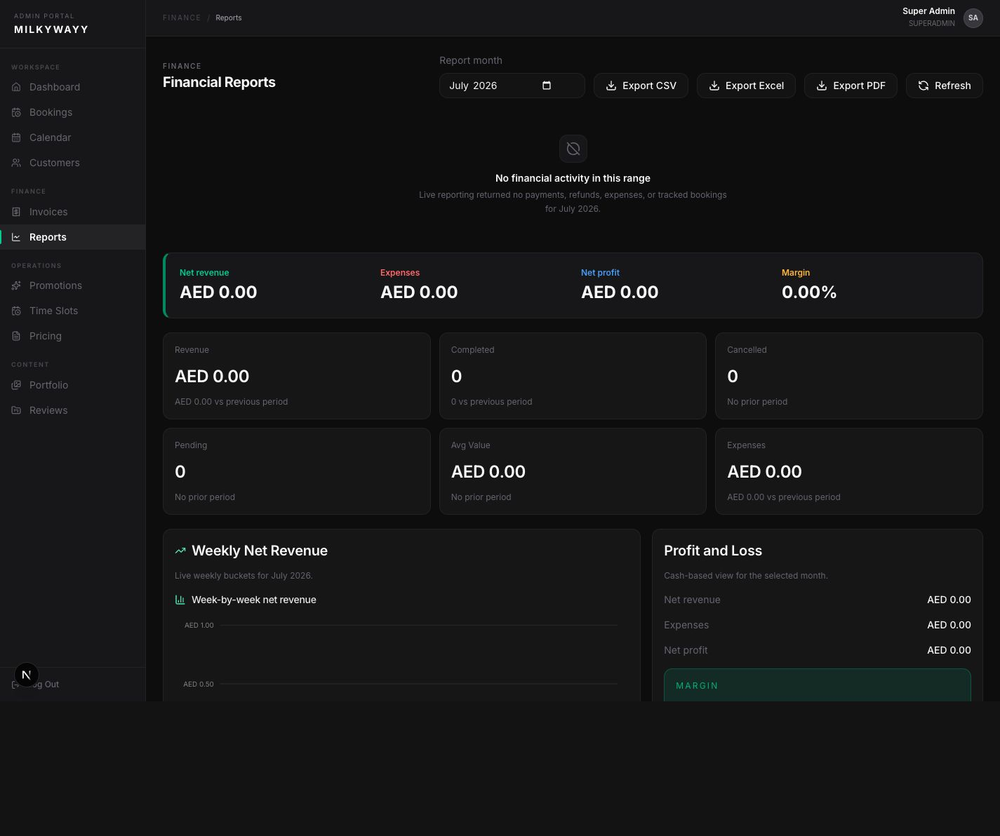
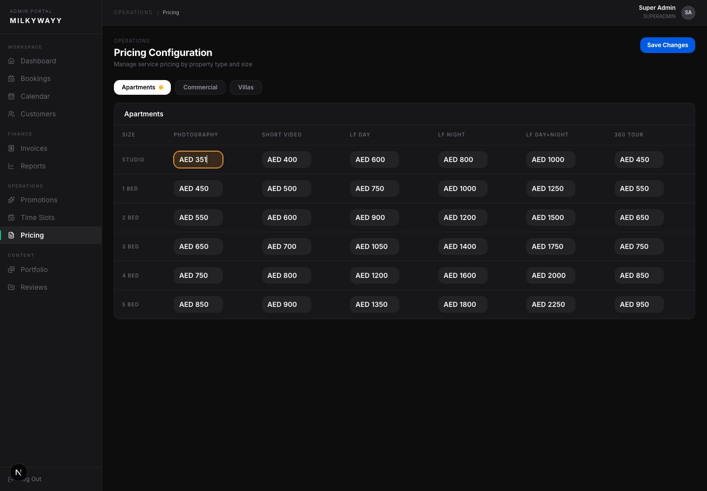
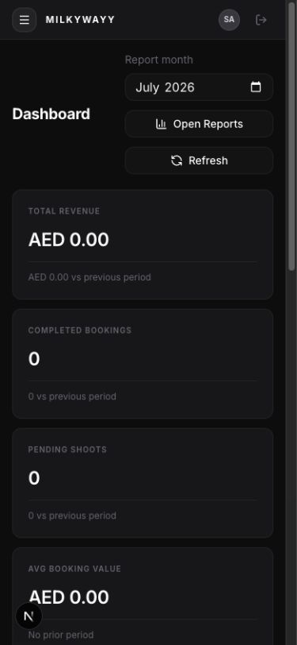
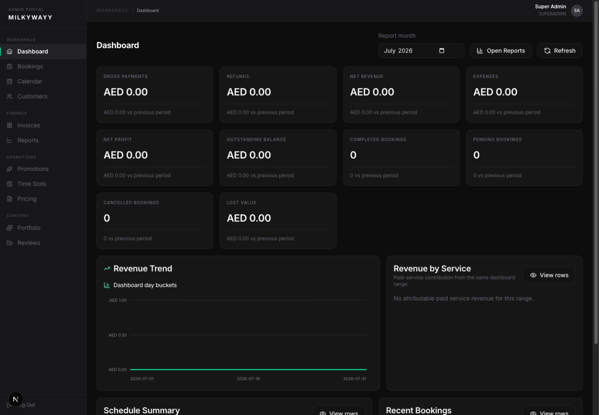
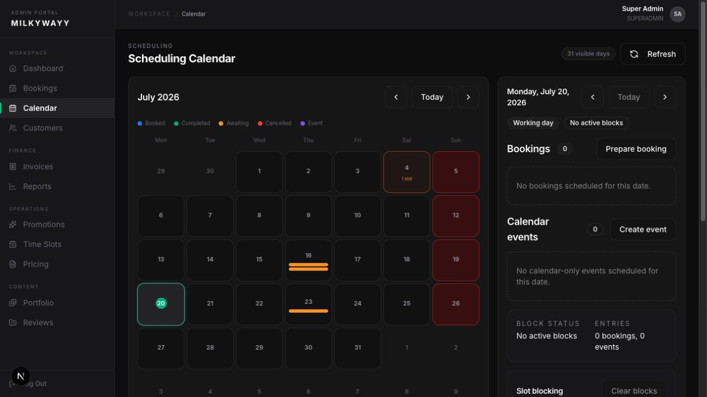
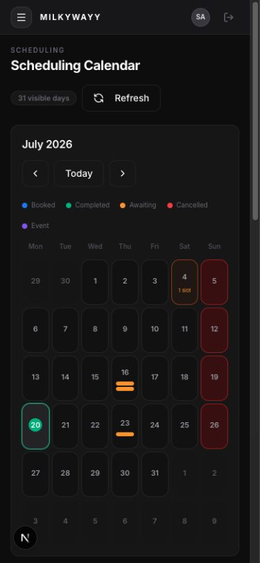
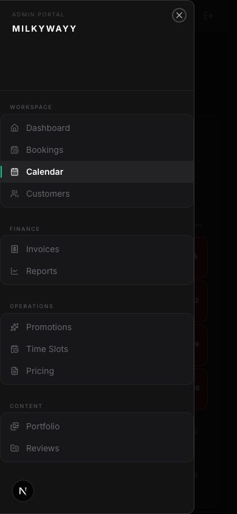

# Issue 26 visual QA

- Captured: 2026-07-20
- Viewports: 1440 × 1000 desktop and 390 × 844 narrow
- Data safety: screenshots are limited to aggregate, configuration, calendar-grid, and navigation surfaces. No customer names, contact values, credentials, private URLs, or production identifiers are included.

## Sanitized screenshots

### Dashboard reference revision

### Reports reference revision

### Pricing unsaved state

### Dashboard narrow reference revision

### Dashboard desktop

### Calendar desktop

### Calendar narrow

### Mobile navigation

## Route-by-route checks

Every current authenticated route was loaded against the local implementation at both viewports. Desktop checks verified the 208-pixel sidebar, 52-pixel header, expected primary heading, and absence of document-level horizontal overflow. Narrow checks verified the desktop sidebar is hidden, the mobile menu is present, the expected primary heading renders, and wide content stays inside intentional local scrollers.

| Surface | Route | Desktop | Narrow |
|---|---|---|---|
| Dashboard | `/admin` | Pass | Pass |
| Bookings | `/admin/bookings` | Pass | Pass |
| Calendar | `/admin/scheduling-calendar` | Pass | Pass |
| Customers | `/admin/users` | Pass | Pass |
| Invoices | `/admin/invoices` | Pass | Pass |
| Reports | `/admin/analytics` | Pass | Pass |
| Promotions | `/admin/promotions` | Pass | Pass |
| Time Slots | `/admin/timeslots` | Pass | Pass after containing the service-weight matrix in its local scroller |
| Pricing | `/admin/prices` | Pass | Pass |
| Portfolio | `/admin/portfolio` | Pass | Pass |
| Reviews | `/admin/reviews` | Pass | Pass |

## Behavior-sensitive visual checks

- Dashboard and Reports use the reference hierarchy and density while retaining live metrics, current filters, and existing actions.
- Reports opens directly to its own content rather than rendering the Dashboard above it.
- Promotions uses compact type tabs and a single dense management table without the previous summary/explainer panels.
- Time Slots contains configuration only. All month-calendar and date-blocking UI remains exclusively in Calendar.
- Pricing shows an amber changed-cell outline and an amber property-type tab dot for unsaved edits; both clear after a successful save.
- Portfolio and Reviews retain icon-only reorder handles without visible `DRAG`, `Order`, or bare rank values.
- Calendar month cells remain fixed height and show at most two short status markers plus `+N` overflow.
- Calendar selected-day hierarchy presents bookings and events before availability controls.
- Calendar exposes named-slot blocking without exact-time or dedicated full-day creation controls; Time Slots only defines the slots and capacity rules.
- The mobile drawer exposes every current navigation group and route.
- Wide tables and configuration matrices scroll inside their panels without widening the document.
