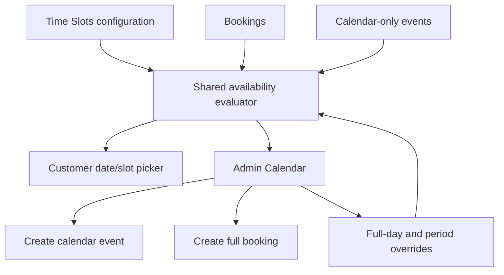

# Admin scheduling calendar architecture

- Last updated: 2026-06-30

## Scheduling authority

The existing Time Slots configuration remains the source for working weekdays,
period definitions, rolling window, capacity, property weights, service weights,
and date overrides. The Calendar is a new view and mutation surface over that
same scheduling domain.

## Effective availability precedence

For a date and period, evaluate in this order:

1. Explicit full-day block.
2. Explicit period block.
3. Non-working weekday baseline.
4. Capacity consumed by active bookings and capacity-consuming calendar events.
5. Remaining property/service weight capacity for the requested booking.
6. Customer rolling-window restriction.

The rolling window limits customer selection. Authorized administrators may
create future entries outside it, but must still receive block/capacity warnings
and explicitly confirm an allowed override.

Existing bookings are not cancelled or moved when a later block is added. The
block flow must show affected records and require confirmation.

## Calendar-only event model

Create a dedicated persisted record with at least:

- `id`, `title`, optional description and property/contact summary;
- local business date, period and/or start/end time;
- `consumesCapacity` and reserved capacity units;
- status (`ACTIVE`, `CANCELLED`);
- `createdBy`, `updatedBy`, timestamps, and cancellation metadata.

Calendar-only events do not create transactions, invoices, delivery workflows,
or customer dashboard records. Cancellation releases their reservation.

## Full admin booking

The admin flow calls a shared booking-creation service used by the customer
flow. It creates a normal Booking and related pricing data, but accepts an
explicit admin payment state instead of requiring Stripe checkout. It must not
duplicate pricing or availability calculations in the page.

## Query boundary

A bounded calendar query accepts validated `start` and `end` dates and returns:

- bookings with display-safe customer, property, service, amount, slot, and status data;
- calendar-only events;
- effective full-day/period blocks and working-day metadata;
- summary counts needed by the month and upcoming views.

Mutations use separate permission-checked endpoints/services for events,
bookings, and overrides.

## Concurrency

Creation and capacity-changing mutations re-evaluate availability inside the
server operation immediately before commit. A stale browser view cannot force a
silent double booking. Explicit administrative overrides are actor-attributed
and auditable.

## Time handling

Scheduling dates and month/day labels use the Dubai business timezone. Persist
date-only fields as business dates and instants as UTC; do not derive business
dates from the server machine timezone.
