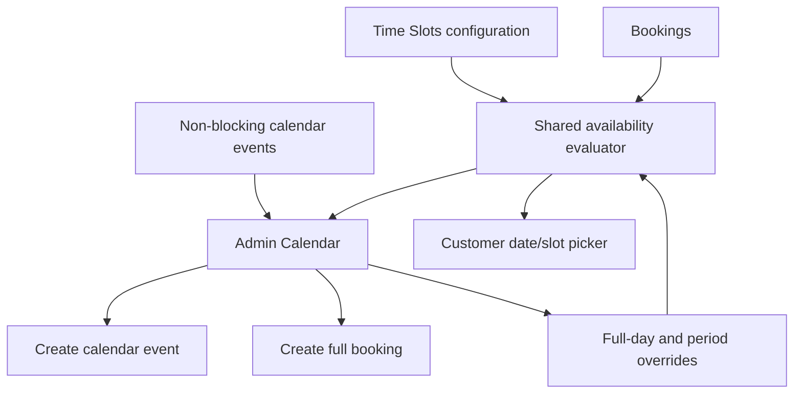

# Admin scheduling calendar architecture

- Last updated: 2026-08-20

## Scheduling authority

The existing Time Slots configuration remains the source for working weekdays,
period definitions, rolling window, property weights, service weights, and date
overrides. The Calendar is a new view and mutation surface over that same
scheduling domain.

## Effective availability precedence

The current booking evaluator uses exclusive named-period reservations rather
than aggregate shared-capacity accounting. Property and service weights
determine whether each booking requires one or two adjacent periods; every
required period is then reserved as a whole. A second booking cannot overlap an
active booking or another property in the same request, even if the combined
weights would fit under a theoretical capacity total.

For a date and period, evaluate in this order:

1. Explicit full-day block.
2. Explicit time-range block, evaluated against the booking's actual scheduled interval.
3. Non-working weekday baseline.
4. Exclusive periods consumed by active bookings or other requested properties.
5. Customer rolling-window restriction.

The rolling window limits customer selection. Authorized administrators may
create future entries outside it, but must still receive availability warnings
and explicitly confirm an allowed override where the conflict type permits one.

Existing bookings are not cancelled or moved when a later block is added. The
block mutation must fail when its interval overlaps an active booking. The UI
must identify and link the affected booking, direct the administrator to manage
it in the Bookings section, and allow the block to be retried only after the
booking no longer conflicts. There is no block override for active bookings.

Administrators choose exact block start and end times in 30-minute increments,
for example `10:00`-`10:30` or `10:00`-`12:30`. A block consumes all customer
availability during that interval; administrators do not enter capacity units
for blocks. Any customer booking whose scheduled interval overlaps the block is
rejected. Full-day blocking remains available as a shortcut.

## Calendar-only event model

Calendar-only events remain informational and never affect customer
availability. Their operator-facing contract is:

- required title and Dubai business date;
- optional description;
- full-day or 30-minute-aligned start/end selection;
- status (`ACTIVE`, `CANCELLED`), actor attribution, and audit timestamps.

Past events are read-only. Events do not create transactions, invoices,
delivery workflows, customer dashboard records, or availability reservations.

## Admin booking preparation and customer handoff

The Super Admin may prepare multiple properties for an existing or
not-yet-registered customer. Preparation creates a secure, auditable handoff in
an implicit payment-pending state; the admin does not choose payment status or
override price or availability.

For a new customer, the handoff opens editable prefilled name, optional company
name, email, admin-entered phone number, and property details. The customer
completes registration, verifies their phone using the existing OTP flow,
reviews the editable properties, and continues to payment. For an existing
customer, the handoff opens directly at property review.

Property review uses the same canonical booking form, responsive
`PropertyCard` controls, validation, scheduling behavior, dynamic pricing, and
main order-summary layout as `/booking`. Explicit adapters keep side effects
separate: normal mode loads and autosaves session-owned drafts and creates the
normal bookings/transaction, while handoff mode maps every prepared property
plus the server-resolved customer contact into initial form values. Handoff
mode has no normal draft adapter and submits the final property array and
optional entered code only to `/api/booking-handoffs/[token]/checkout`, which
continues to synchronize the existing transaction and reservations.

Handoff mode sends only the opaque token, advisory subtotal, and optional code
to `/api/booking-handoffs/[token]/promotion-preview`. The route rate-limits the
token and request source, validates the current token version, four-hour expiry,
payment state, registration/OTP state, and transaction customer, then evaluates
the same automatic, personal, and generic-code selector used by normal booking.
It never accepts a browser-supplied customer identifier. The shared order summary
shows that selected benefit and the same separately calculated wallet-credit
earning as `/booking`.

Checkout does not trust the preview. It re-resolves the token after locking the
existing `Transaction`, revalidates current customer ownership, link state,
availability, property pricing, promotion eligibility and limits, and then
updates, adds, or removes that transaction's draft bookings atomically. It
releases and replaces any prior promotion reservation and pending wallet credit,
stores the final promotion snapshot and payable amount, and creates Stripe for
that amount without creating a normal draft or second transaction. A failed
Stripe/database handoff rolls database changes back and expires any newly
orphaned Stripe session so the same link can retry safely.

New-customer validation uses one shared boundary for preparation and handoff
registration. Optional snapshot strings accept their persisted `null`
representation: company name, billing address, TRN, and email may be null for an
Individual customer, while contact full name and TRN may be null for a Company
customer. Company customers still require a non-blank company name, billing
address, and email. API responses reduce genuine schema failures to one concise
validation message while the complete error remains available to server-side
diagnostics.

After an OTP is sent, the handoff keeps the destination visible but locks the
account and customer fields so they cannot diverge from the active verification
attempt. The customer may clear that client attempt with **Change details** or
request another code after a 30-second client-side cooldown; OTP entry remains
available throughout the active attempt.

Final validation and checkout reuse normal availability, pricing, eligible
coupon, promotion, discount, wallet, payment, and invoice services. Completed
bookings appear in the customer dashboard. A checkbox, unselected by default,
lets the admin send the handoff through WhatsApp; registration-required and
registered-customer flows use distinct templates. The admin can copy the secure
payment link at any time.

The link and its pending availability reservation expire after four hours. The
pending booking blocks conflicting customer selection during that window but is
labelled as a pending hold, not a booked shoot. Successful payment promotes it
through the existing confirmed-booking flow. An admin can generate a replacement
link from the latest details; regeneration invalidates the previous link and
starts a new four-hour link and reservation window.

The handoff service initializes Sequelize model relations at its module
boundary. Public reads, OTP endpoints, checkout, and admin regeneration can
therefore eager-load `Transaction.user` without depending on another route to
run first. OTP sending, OTP verification, replacement-link regeneration, and
checkout resolve or reload the handoff inside a database transaction. Their
joined transaction queries keep the associated customer available while
scoping `FOR UPDATE` to the non-nullable root `Transaction` row. The nullable
`user` side of the outer join is not locked, avoiding PostgreSQL outer-join
lock errors without weakening serialization of concurrent handoff use.

## Query boundary

A bounded calendar query accepts validated `start` and `end` dates and returns:

- bookings with display-safe customer, property, service, amount, slot, and status data;
- calendar-only events;
- effective full-day/period blocks and working-day metadata;
- summary counts needed by the month and upcoming views.

Mutations use separate permission-checked endpoints/services for events,
bookings, and overrides.

## Concurrency

Creation and capacity-changing mutations re-evaluate availability inside the
server operation immediately before commit. A stale browser view cannot force a
silent double booking. Explicit administrative overrides are actor-attributed
and auditable.

## Time handling

Scheduling dates and month/day labels use the Dubai business timezone. Persist
date-only fields as business dates and instants as UTC; do not derive business
dates from the server machine timezone.
