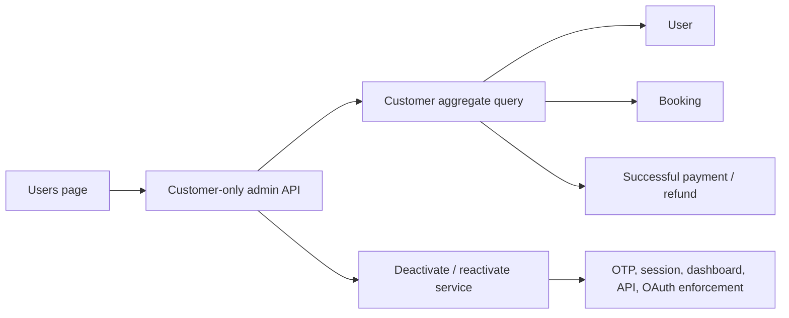

# Admin customer management architecture

- Last updated: 2026-08-12

## Boundary

Users is a customer-management surface. Its base query always includes
`role = CUSTOMER`; no client-provided filter can broaden that boundary. Staff
queries and mutations belong to Settings.

## Customer list query

The server supports validated page size, cursor/page, search, sort key, and sort
direction. Allowed sort keys are name, booking count, net spend, and creation
date. Stable ID ordering breaks ties.

Returned aggregates include:

- booking count under the status policy defined by USR-002;
- net spend using the finance feature's net successful-payment definition;
- customer activation state;
- display-safe profile and billing/company summary fields needed by the UI.

Summary KPIs are computed from the complete filtered customer population, not
only the current page.

## Account state

The completed lifecycle slice adds `disabledAt` rather than deleting rows.
Actor/reason audit metadata and a session invalidation/version value remain
future work if the broader account-control scope is resumed.

Disablement prevents new OTP issuance and rejects OTP verification if the
customer is disabled after issuance. Historical bookings, payments, invoices,
files, wallet entries, and audit records remain intact. Existing-session and
OAuth-token invalidation remain outside this completed slice. As a bounded
defense, customer booking-list reads reload the current database customer and
reject a disabled account; this does not claim complete invalidation across all
dashboard, API, or OAuth paths.

## Mutation boundary

Create/deactivate/reactivate operations run through permission-checked
services. Current lifecycle mutations require a database-backed `SUPERADMIN`
actor rather than trusting the role stored in a session cookie. Users does not
expose customer editing or role changes.

Disablement requires explicit confirmation. Enabling is a separate action and
does not silently restore revoked OAuth grants.

## Staff separation

The role migration in `admin-access-control` supplies `SUPERADMIN`, `ADMIN`, and
`ACCOUNTS`. All three are excluded from customer queries and counts and are
visible only through Settings staff management.
