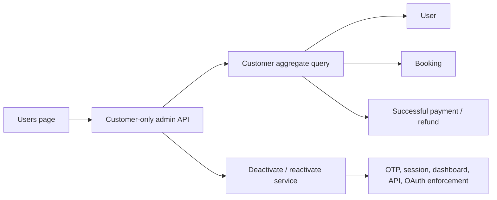

# Admin customer management architecture

- Last updated: 2026-06-30

## Boundary

Users is a customer-management surface. Its base query always includes
`role = CUSTOMER`; no client-provided filter can broaden that boundary. Staff
queries and mutations belong to Settings.

## Customer list query

The server supports validated page size, cursor/page, search, sort key, and sort
direction. Allowed sort keys are name, booking count, net spend, and creation
date. Stable ID ordering breaks ties.

Returned aggregates include:

- booking count under the status policy defined by USR-002;
- net spend using the finance feature's net successful-payment definition;
- customer activation state;
- display-safe profile and billing/company summary fields needed by the UI.

Summary KPIs are computed from the complete filtered customer population, not
only the current page.

## Account state

Add explicit disable metadata rather than deleting rows:

- `disabledAt`;
- `disabledBy`;
- `disabledReason`;
- a session invalidation/version value if required by the selected session design.

Deactivation prevents new OTP/login and invalidates or rejects existing
sessions and OAuth access. Historical bookings, payments, invoices, files,
wallet entries, and audit records remain intact.

## Mutation boundary

Create/edit/deactivate/reactivate operations run through permission-checked
services. Editable fields use the existing customer schema for individual and
company accounts. Role cannot be changed through Users.

Deactivation requires an explicit reason and confirmation. Reactivation is a
separate audited action and does not silently restore revoked OAuth grants unless
that behavior is explicitly approved.

## Staff separation

The role migration in `admin-access-control` supplies `SUPERADMIN`, `ADMIN`, and
`ACCOUNTS`. All three are excluded from customer queries and counts and are
visible only through Settings staff management.
