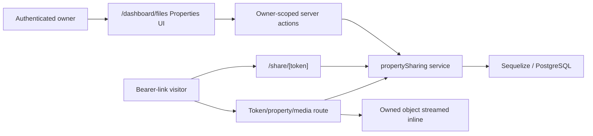

# Customer property showcase architecture

## Trust boundaries and flow

`src/lib/services/propertySharing.js` owns listing validation integration,
eligibility, ownership, transactions, stable public-ID lookup, selected-booking
membership, current-media revalidation, safe-media classification, public DTOs,
and total-view updates. Client components receive serialized owner/public data
and never decide access.

## Persistence

The unreleased migration `20260722090000-create-property-sharing.js` creates:

| Table | Purpose |
|---|---|
| `property_share_listings` | One owner+booking listing configuration with bounded listing/contact fields and highlights. |
| `property_share_links` | Owner, kind, optional single booking, unique 43-character opaque public ID, enabled state, and total link views. |
| `property_share_properties` | Explicit ordered booking membership for a link. |
| `property_share_media` | Ordered exact delivery-file+version membership for each selected property. |

Unique indexes enforce one single link per owner/booking and one master per
owner. A unique owner+booking listing index prevents duplicate configuration.
Owner-row locks serialize competing creates before the constraint backstop.
Successful landing requests atomically increment the link total.

There is no contact-submission, receipt, daily-view, public-file-manifest,
raw-view-event, visitor, IP, user-agent, referrer, fingerprint, or location
schema.

## Listing and link lifecycle

Only the booking owner can save listing configuration, and only when the
booking is confirmed, non-cancelled, and has at least one safe current media
version under review or accepted. Listing fields remain editable and update
active public presentation.

Single/master creation and explicit media refresh transactionally replace each
selected property's snapshot rows with every currently eligible safe
file+version across service types. Later uploads and replacements do not change
existing membership. Updating a master selection refreshes selected properties
as part of the same explicit owner action.

Creation generates 32 random bytes encoded as a 43-character base64url public
identifier. PostgreSQL persists that stable identifier so the owner can copy
the same URL after reload. The identifier is intentionally shareable and has
no rotation, revocation, expiry, or one-time presentation. Disabling and
re-enabling changes only the enabled flag.

## Public resolution and inline media isolation

Every public page and media request re-resolves the public ID and checks enabled
state, selected membership, owner/booking/listing alignment, confirmed
non-cancelled booking state, exact snapshot membership, current-version
identity, under-review/accepted state, deletion, supersession, and a
browser-safe MIME/type allow-list. Invalid, malformed, disabled,
wrong-property, unselected, stale, and cross-owner scopes use the same generic
unavailable result.

Public page DTOs contain listing content and valid snapshotted photo/video
identifiers, but no persisted object URL or internal review status. The browser builds only the
token-scoped inline media path. The route parses the internally resolved owned
object URL, requests that exact object server-side, forwards valid byte ranges,
preserves accurate content type and range headers, and never redirects,
advertises an attachment, or uses `/api/files/download`.

An accepted 360 delivery is a validated HTTPS `text/uri-list` copy-link rather
than an owned S3 object. The service emits its normalized embed URL separately;
the showcase exposes a text/icon tile in the media strip without an image
thumbnail, renders it in a no-referrer iframe in the main viewer, and never
sends it to the S3 media route.

Only successful collection/showcase resolution increments total link views.
Metadata resolution reuses the same validity and membership checks without
incrementing the total, so one rendered page contributes one view even though
Next.js also builds dynamic head metadata. Open Graph images reference only the
first ordered image through the token/property/media boundary; they never
serialize an owned object URL. Media requests and failed resolutions do not
count.
