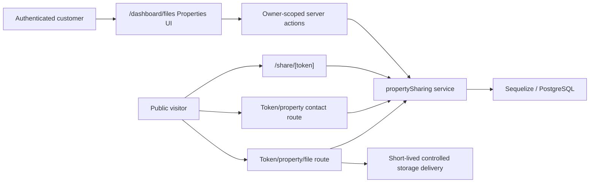

# Customer property sharing architecture

## Trust boundaries and flow

`src/lib/services/propertySharing.js` owns eligibility, ownership,
transactions, snapshots, token lookup, public revalidation, contacts,
retention reads, and aggregate updates. Client components receive serialized
owner/public DTOs and do not decide security state.

## Persistence

The migration `20260722090000-create-property-sharing.js` adds:

| Table | Purpose |
|---|---|
| `property_share_links` | Owner, kind, optional single booking, unique SHA-256 token digest, credential version, enabled/revoked state, total request views, and last viewed time. |
| `property_share_properties` | Explicit selected booking membership and display order. |
| `property_share_files` | Exact delivery-file and delivery-file-version membership for one shared property. |
| `property_share_daily_views` | One aggregate request-view counter per share and Dubai calendar date. |
| `property_share_contacts` | Name, normalized phone, property scope, and 90-day expiry. |

Partial unique indexes enforce one non-revoked single link per owner/booking and
one non-revoked master link per owner. Creation also locks the owner row, so
concurrent service calls serialize before the constraint backstop. Daily counts
use `INSERT ... ON CONFLICT ... request_views + 1`; the link total and last-view
time update in the same transaction.

There is no plaintext-token column, raw page-view table, visitor table, IP
column, user-agent column, referrer column, fingerprint, location, or contact to
analytics association.

## Tokens, receipts, and rotation

Share creation and rotation generate 32 random bytes and encode them as a
43-character base64url bearer token. PostgreSQL stores only its unique
lowercase SHA-256 digest. The plaintext public URL is returned only in that
mutation response and is not reconstructable later.

Rotation replaces the digest and increments `credential_version` in one locked
transaction. The old token stops resolving immediately, aggregate history stays
on the link, and receipts issued under the previous credential version stop
verifying.

A successful contact submission creates a signed HS256 receipt containing only
share ID, share-property ID, credential version, issue time, and expiry. It is
stored in an HttpOnly, SameSite=Lax cookie, Secure in production, and expires in
at most 24 hours. It contains no contact data.

## Public resolution and file isolation

Every landing, contact, manifest, and file operation re-resolves the token and
re-checks enabled/revoked state, selected booking ownership and completion,
accepted non-deleted file state, current-version identity, pinned-version
identity, and supersession state. Any stale member invalidates resolution.
Malformed, unknown, disabled, revoked, stale, and unselected scopes use the same
generic not-found result and failed landings do not increment analytics.

Public page and JSON DTOs omit stored delivery URLs. File buttons point only to
the token/property/snapshot application route. That route validates the receipt
and exact membership again, accepts only a configured booking-storage object,
and then creates a delivery URL for that one pinned version. Public delivery is
capped at five minutes or the lower configured S3 download TTL.

## Contact and analytics separation

The contact route accepts a JSON object whose keys are exactly `name` and
`phone`. It normalizes whitespace and phone punctuation, validates bounded
length/format, and rejects unknown keys. Contact rows expire 90 days after
creation and owner reads filter them immediately at the expiry boundary.

Contact abuse throttling is in-memory and bounded. A network address, when
available, is converted immediately to a keyed digest held only in an expiring
process bucket. The address and digest are never persisted, logged, returned,
or used for analytics.
