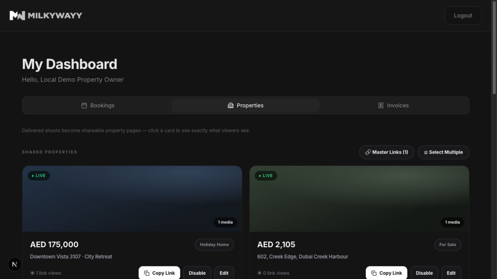

# Issue #70 browser proof

Synthetic local data was used for this verification. Public bearer values and
contact details are not recorded.

## Immediate Shared Properties reconciliation

At a 1280×720 browser viewport, the **Downtown Vista 3107 · City Retreat**
listing form was submitted from its Delivered files card. Without a manual
browser reload:

- the dialog closed and the success toast appeared;
- the new listing appeared as the first **Shared Properties** card;
- its corresponding **Create Share Link** action count changed from one to
  zero.
- the new card began at zero views and showed one view after exactly one public
  page navigation, confirming metadata generation did not add a second count.

## Rendered metadata

The created public page rendered:

- document and Open Graph title:
  `Downtown Vista 3107 · City Retreat | Milkywayy`;
- the synthetic owner-authored listing description in both the standard and
  Open Graph description tags;
- matching canonical and Open Graph URLs under `/share/[redacted]`;
- an Open Graph image under the existing
  `/api/public/property-shares/[redacted]/properties/11/media/8` boundary;
- `noindex, nofollow, nocache` robots and `no-referrer` referrer metadata.

The public service regression test separately verifies that metadata resolution
does not update the link-view total and does not contain the persisted private
object URL.
