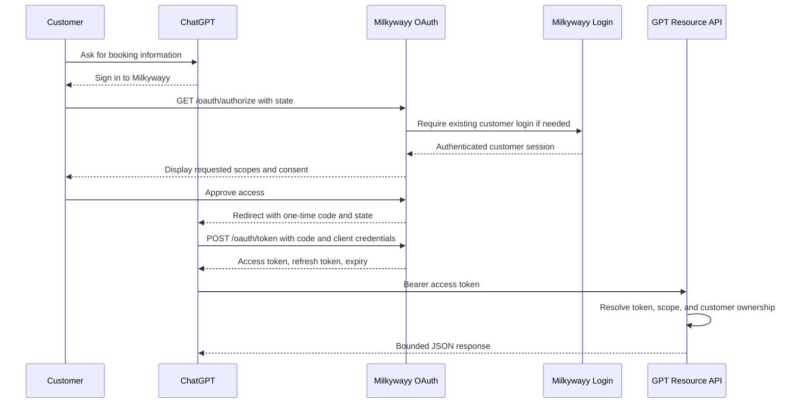

# GPT Actions OAuth target architecture

- Last updated: 2026-07-01
- Architecture status: `ACCEPTED`

## Context

Milkywayy currently authenticates customers through phone OTP and stores the customer profile in a signed, HTTP-only session cookie. ChatGPT cannot use that cookie when calling APIs. It needs an OAuth access token tied to the customer and limited to approved scopes.

The implementation should add an OAuth protocol boundary without replacing the existing website login in the first release.

## End-to-end flow

## Component boundaries

### OAuth protocol module

Create a framework-light module under a dedicated boundary such as `src/lib/oauth/`. It owns:

- Client lookup and authentication.
- Authorization request validation.
- Authorization-code issuance and atomic consumption.
- Access-token issuance and validation.
- Refresh-token rotation and reuse detection.
- Scope parsing and enforcement.
- Revocation and consent records.
- OAuth error objects and audit-event generation.

The module must not import React components. Route handlers and pages call this module.

### Existing authentication module

Extract reusable credential verification from `src/lib/actions/auth.js` so website login and OAuth login use the same customer verification rules. Cookie writes remain in the web-session layer. The OAuth module consumes an authenticated user ID and does not issue the website session itself.

### Resource API

Create a versioned route boundary such as `src/app/api/gpt/v1/`. It owns:

- Bearer-token extraction.
- Access-token expiry and revocation checks.
- Scope checks.
- Customer ownership filters on every query.
- Stable, bounded JSON response DTOs.
- Cursor pagination and safe filters.

It must not expose Sequelize model instances, password/OTP fields, internal role data, payment secrets, S3 keys, or unrestricted signed download URLs.

## Planned OAuth endpoints

| Method and path | Purpose | Authentication |
|---|---|---|
| `GET /oauth/authorize` | Validate request, require login/consent, issue code, and redirect. | Existing Milkywayy customer session |
| `POST /oauth/token` | Exchange a code or rotating refresh token. | OAuth client ID and secret |
| `POST /oauth/revoke` | Revoke a token or refresh-token family. | Client authentication or signed-in customer |
| `GET /dashboard/connections` | List and disconnect customer-authorized clients. The route remains direct-path only and is intentionally omitted from visible dashboard tabs until the release is ready. | Existing Milkywayy customer session |

The token endpoint must accept `application/x-www-form-urlencoded`. The registered ChatGPT client explicitly permits both `client_secret_post` and `client_secret_basic`. Requests with missing, duplicated, conflicting, or malformed credentials are rejected, and both permitted methods are tested during integration.

### Authorization request validation

Required parameters:

- `response_type=code`
- Known and enabled `client_id`
- Exact registered `redirect_uri`
- Non-empty `state`
- Space-delimited allowed `scope`

Rules:

- Never redirect to an unvalidated URI, including for errors.
- Return `state` unchanged after a valid authorization request.
- Reject unknown scopes and unsupported response types.
- Preserve the validated authorization interaction across OTP login using a server-side interaction ID or a signed, short-lived internal value.
- Require CSRF protection on approval and denial submissions.
- Authorization codes expire quickly, are single-use, and are bound to client, user, redirect URI, and scopes.
- Do not require PKCE for the ChatGPT client because the currently documented GPT Actions exchange does not include PKCE. The data model may retain optional PKCE fields for future clients.

## Planned first-release action API

The accepted first-release read-only surface is:

| Method and path | Scope | Purpose |
|---|---|---|
| `GET /api/gpt/v1/me` | `customer:read` | Return minimal connected-account identity. |
| `GET /api/gpt/v1/bookings` | `customer:read` | List the customer's bookings with bounded filters and pagination. |
| `GET /api/gpt/v1/bookings/{bookingCode}` | `customer:read` | Return one customer-owned booking by public booking code. |
| `GET /api/gpt/v1/invoices` | `customer:read` | Return invoice metadata and safe website links. |
| `GET /api/gpt/v1/files` | `customer:read` | Return customer-visible delivery-file metadata and authenticated website links. |

Files and invoice PDFs are not transferred through an action. File DTOs may
contain safe identifiers, customer-visible filenames, types, statuses, revision
state, and the generic website URL `/dashboard/files`. Numeric `fileId` remains
resource/filter metadata. DTOs must not contain S3 keys, direct storage URLs,
unrestricted signed URLs, or binary content.

The authenticated dashboard does not resolve, scroll to, highlight, open, or
emit existence feedback for a `fileId` query value.

All mutation endpoints are deferred. If later introduced, they require separate write scopes, idempotency keys where applicable, stronger audit trails, and `x-openai-isConsequential: true` in the OpenAPI document.

## Scopes

| Scope | Data granted | Initial status |
|---|---|---|
| `customer:read` | Minimal account identity, customer-owned bookings, invoice metadata, and delivery-file metadata. | Accepted |
| `bookings:write` | Create or change bookings. | Deferred |
| `payments:write` | Initiate payment-related operations. | Out of scope |

OAuth scopes are authorization capabilities. Existing application roles remain separate and must not be inferred from scopes.

Initial consent text for `customer:read` is: "View your account, bookings, invoices, and delivery-file metadata."

## Persistence model

Use Sequelize migrations and models consistent with the existing project.

### `oauth_clients`

- `id`
- `clientId` unique public identifier
- `clientSecretHash`
- `name`
- `redirectUris` JSON array
- `allowedScopes` JSON array
- `tokenEndpointAuthMethods` JSON array containing only explicitly enabled methods
- `isEnabled`
- timestamps

Only a salted password hash of the client secret is stored. The generated secret is displayed or transferred once during controlled provisioning.

### `oauth_authorization_codes`

- `id`
- `codeHash` unique
- `clientId` foreign key
- `userId` foreign key
- `redirectUri`
- `scopes` JSON array
- optional `codeChallenge` and `codeChallengeMethod`
- `expiresAt`
- `consumedAt`
- timestamps

The raw code is returned once and never persisted.

### `oauth_access_tokens`

- `id`
- `tokenHash` unique
- `clientId` foreign key
- `userId` foreign key
- `scopes` JSON array
- `refreshFamilyId`
- `expiresAt`
- `revokedAt`
- timestamps

### `oauth_refresh_tokens`

- `id`
- `tokenHash` unique
- `clientId` foreign key
- `userId` foreign key
- `scopes` JSON array
- `familyId`
- `parentTokenId`
- `expiresAt`
- `consumedAt`
- `revokedAt`
- timestamps

Refresh tokens rotate on every successful use. Reuse of a consumed token revokes the token family and emits a high-severity audit event.

### `oauth_consents`

- `id`
- `clientId` foreign key
- `userId` foreign key
- `scopes` JSON array
- `grantedAt`
- `revokedAt`
- timestamps

### `oauth_audit_events`

- `id`
- `correlationId`
- `eventType`
- optional `clientId` foreign key
- optional `userId` foreign key
- `outcome`
- `reasonCode`
- safe bounded `metadata` JSON
- `createdAt`
- `expiresAt`

Audit records are retained for 30 days and removed by a bounded cleanup operation. The application also emits equivalent structured logs, but the database table is authoritative because production log retention is not guaranteed. Never persist or log raw secrets, codes, tokens, OTPs, cookies, full authorization headers, or unnecessary personal data. Audit persistence failures are monitored and handled according to an explicit fail-open/fail-closed policy per event category.

### `oauth_rate_limits`

- `id`
- `bucketType`
- `keyHash`
- `windowStart`
- `requestCount`
- `expiresAt`
- timestamps

Rate-limit counters use atomic PostgreSQL operations and hashed identifiers where the key contains customer-controlled or personal data. Expired buckets are removed by bounded cleanup. The limiter must remain correct across PM2 restarts and if the web process count increases.

## Token policy

Accepted initial values:

| Artifact | Lifetime | Storage |
|---|---:|---|
| Authorization interaction | 10 minutes | Server-side or signed short-lived value |
| Authorization code | 2 minutes | Hash only; one-time use |
| Access token | 15 minutes | Hash only |
| Refresh token | 30 days | Hash only; rotating family |
| Consent | Until revoked or scopes change | Database |

Use cryptographically secure random opaque values with at least 256 bits of entropy. Token lookup hashes may use SHA-256 because tokens are random high-entropy secrets; client secrets should use the project's password-hashing mechanism.

## Error contract

OAuth endpoints return standard OAuth error codes where applicable:

- `invalid_request`
- `invalid_client`
- `invalid_grant`
- `unauthorized_client`
- `unsupported_grant_type`
- `invalid_scope`
- `access_denied`
- `temporarily_unavailable`

Resource APIs use stable JSON errors with HTTP `401`, `403`, `404`, `409`, `422`, `429`, or `5xx` as appropriate. They must not reveal whether another customer's record exists.

## Operational constraints

- OAuth and resource API URLs use the same public domain.
- The Next.js application runs under PM2 on the production server.
- Public HTTPS is terminated by the production reverse-proxy chain, and the controlled origin proxy forwards to the PM2-managed Next.js process. Exact live topology details are maintained in `docs/private/PRODUCTION-DEPLOYMENT.md`.
- The application trusts forwarded protocol and host data only from the controlled Nginx proxy and uses the configured public base URL for OAuth redirects; arbitrary request headers never determine redirect origins.
- Every action completes well below the 45-second platform timeout.
- Responses are JSON text and remain below 100,000 characters through pagination and field selection.
- No custom request headers are required beyond standard OAuth authorization.
- `429` responses include a safe retry signal and are monitored.
- OAuth artifact cleanup runs through the internal `POST /api/internal/oauth/cleanup` endpoint protected by `CRON_SECRET`; each run deletes expired or revoked rows in bounded batches so active grants remain untouched and issuance paths are not blocked indefinitely.
- Production runs `npm run worker:oauth-cleanup` under PM2 at least hourly against the local application URL. The Milkywayy application operator owns the worker process, `CRON_SECRET`, and monitoring of cleanup failures or repeated batch-limit hits.
- Database migrations are backward-compatible and deployed before application code that requires them.
- Rollback must leave existing website login and booking flows functional.
