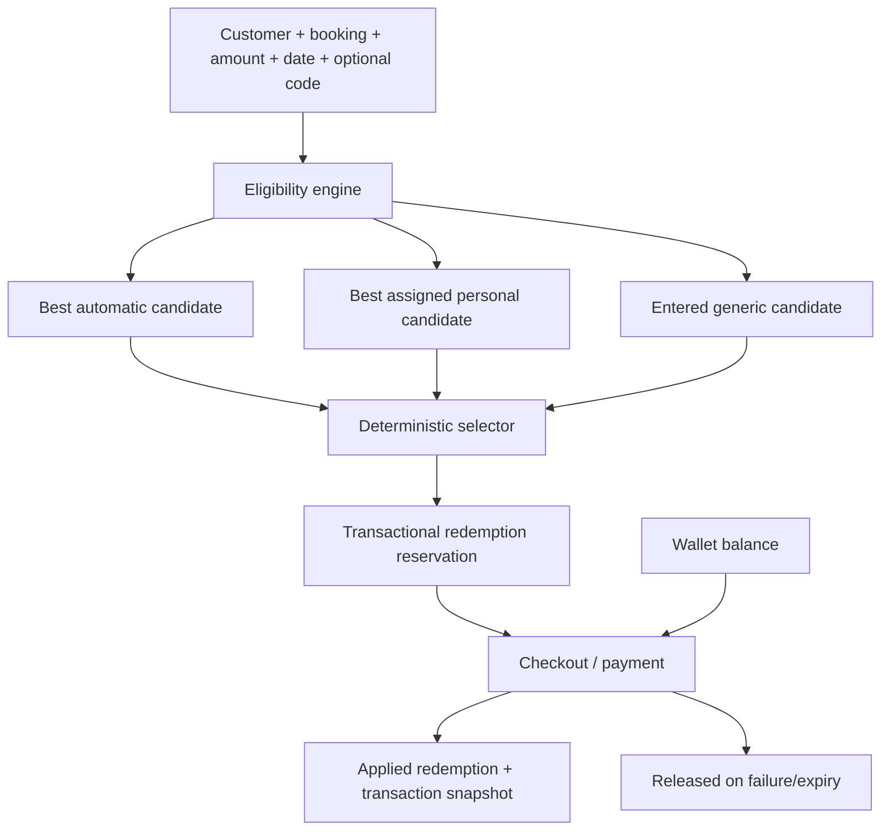

# Promotions management architecture

- Last updated: 2026-06-30

## Domain model

Introduce a unified promotion domain while retaining legacy reads during a
staged migration.

### Promotion

Stores kind (`GENERIC`, `PERSONAL`, `AUTOMATIC`), code/name, benefit type
(`FIXED`, `PERCENTAGE`), amount/percentage/cap, minimum spend, start/end,
per-user and total limits, trigger type/configuration, status, system flag,
priority, creator/updater, and timestamps.

### Promotion assignment

Links personal promotions to active customer users. Staff accounts are never
valid assignment targets.

### Promotion redemption

Tracks customer, promotion, booking/transaction, calculated benefit, and state
(`RESERVED`, `APPLIED`, `RELEASED`). Unique constraints and transactional locks
protect limits under concurrent checkout.

Transactions gain a promotion reference and calculation snapshot. Existing
coupon references remain readable during compatibility rollout.

## Selection algorithm

1. Evaluate active automatic rules and select the highest monetary benefit.
2. If an eligible personal promotion exists, select the best personal benefit
   instead of the automatic result.
3. If the customer enters an eligible generic code, replace the selected result
   only when its calculated monetary benefit is strictly higher.
4. Apply exactly one selected promotion.
5. Apply wallet credit separately under existing wallet limits.

Benefit comparisons happen against the same pre-promotion eligible subtotal.
Ties retain the earlier selected candidate, giving personal precedence over
generic ties and automatic rules.

## Trigger semantics

First/second booking rules count successful paid bookings under one documented
policy and must be rechecked at reservation/finalization. Date-range rules use
Dubai business dates. Trigger configuration is validated by type rather than
executed as arbitrary expressions.

## Compatibility migration

1. Inventory current coupon rows, system launch behavior, dynamic discount
   configuration, and wallet-credit behavior.
2. Add new schema and dual-read comparison without changing checkout totals.
3. Backfill promotions and transaction references.
4. Enable new engine in shadow/parity mode.
5. Switch writes and checkout evaluation after parity gates pass.
6. Remove the old navigation and stop legacy writes.
7. Defer destructive legacy schema cleanup until rollback is no longer needed.

## Admin API

Permission-checked services expose list/create/update/activate/pause/deactivate
for each promotion kind, assignment lookup, usage totals, and audit history.
Deletion of used/system promotions becomes deactivation rather than physical
deletion.
