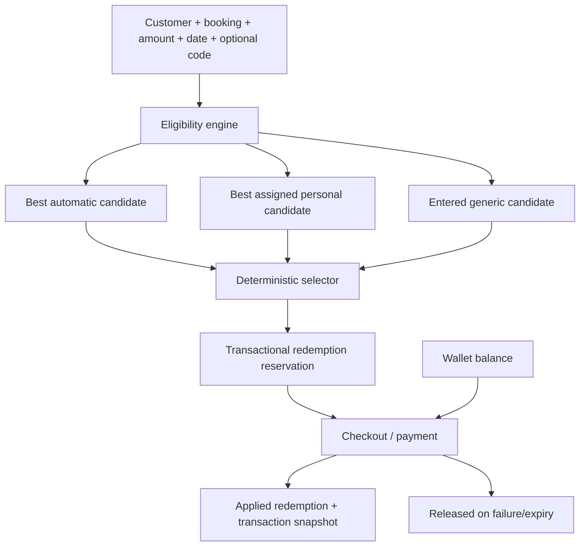

# Promotions management architecture

- Last updated: 2026-07-01

## Domain model

Introduce a unified promotion domain while retaining legacy reads during a
staged migration.

### promotions

`promotions` becomes the canonical table for every selectable non-wallet
benefit. One row represents one generic code, one personal offer, or one
automatic rule.

Required columns:

- identity: `id`, `kind` (`GENERIC`, `PERSONAL`, `AUTOMATIC`), `code`
  nullable for non-generic promotions, `name`, optional `admin_description`,
  optional `customer_message`
- benefit: `benefit_type` (`FIXED`, `PERCENTAGE`), `benefit_value`,
  optional `benefit_cap`, `minimum_spend`
- eligibility window and lifecycle: `starts_at`, `ends_at`, `status`
  (`DRAFT`, `ACTIVE`, `PAUSED`, `DEACTIVATED`), `system_flag`, `priority`
- usage policy: `per_user_limit`, `total_limit`
- trigger contract: `trigger_type` (`NONE`, `FIRST_PAID_BOOKING`,
  `SECOND_PAID_BOOKING`, `ANY_PAID_BOOKING`, `DATE_RANGE`) plus typed
  `trigger_config` JSONB
- migration and audit references: `legacy_source_type`, `legacy_source_id`,
  `created_by_user_id`, `updated_by_user_id`, timestamps

Constraints:

- generic codes stay unique case-insensitively while active
- `code` is required only for `GENERIC`
- `trigger_type = NONE` is required for `GENERIC` and `PERSONAL`
- `trigger_type != NONE` is required for `AUTOMATIC`
- fixed benefits require an amount and percentage benefits require a percent
  plus optional cap

### promotion_assignments

`promotion_assignments` links `PERSONAL` promotions to customer users.

Required columns:

- `id`, `promotion_id`, `user_id`
- assignment lifecycle: `assigned_at`, optional `unassigned_at`
- actor fields: `assigned_by_user_id`, optional `unassigned_by_user_id`
- optional `notes` or `metadata` for support context
- timestamps

Constraints:

- only promotions with `kind = PERSONAL` may be assigned
- only active customer accounts may be assignment targets
- in the current user schema, "active customer accounts" means existing
  `users.role = CUSTOMER` rows until a dedicated disabled/suspended state
  exists (`PRM-D013`)
- one customer may have at most one active row per personal promotion
- unassignment preserves history rather than deleting the row

### promotion_redemptions

`promotion_redemptions` tracks limit consumption and payment lifecycle.

Required columns:

- `id`, `promotion_id`, `user_id`, `transaction_id`
- optional `booking_id` for single-booking cases and compatibility backfills
- calculation snapshot: `eligible_subtotal`, `benefit_amount`,
  `benefit_type_snapshot`, `trigger_snapshot`
- state machine: `state` (`RESERVED`, `APPLIED`, `RELEASED`, `EXPIRED`)
- reservation timing: `reserved_at`, optional `reservation_expires_at`,
  optional `applied_at`, optional `released_at`
- `release_reason`
- timestamps

Concurrency contract:

- limit checks and reservation writes happen in one transaction
- active-count queries only include `RESERVED` and `APPLIED`
- a transaction may own at most one non-released redemption row
- released or expired rows remain for audit and reconciliation

### promotion_audit_events

`promotion_audit_events` is append-only and records every admin mutation that
changes promotion behavior or assignment state.

Required columns:

- `id`, optional `promotion_id`, optional `promotion_assignment_id`
- `actor_user_id`
- `action` (`CREATED`, `UPDATED`, `ACTIVATED`, `PAUSED`, `DEACTIVATED`,
  `ASSIGNED`, `UNASSIGNED`, `MIGRATED`)
- `before_state` JSONB
- `after_state` JSONB
- optional `reason` or `metadata`
- timestamp

This table covers the audit requirement for CRUD, lifecycle, and assignment
changes without mutating historical transaction snapshots.

### transactions compatibility

`transactions` gains:

- `promotion_id` nullable during rollout
- `promotion_redemption_id` nullable during rollout
- `promotion_snapshot` JSONB with the immutable explanation used by checkout,
  invoices, and support tooling

`promotion_snapshot` stores:

- promotion identifiers: `id`, `kind`, optional `code`, `name`
- calculation inputs: `eligible_subtotal`, `benefit_type`, `benefit_value`,
  `benefit_cap`, `minimum_spend`, `trigger_type`, `trigger_config`
- calculation outputs: `benefit_amount`
- source markers needed for migration explainability

Existing `coupon_id`, `coupon_deduction`, `bulk_deduction`, and metadata
remain readable during compatibility rollout and are not repurposed in place.

## Selection algorithm

1. Evaluate active automatic rules and select the highest monetary benefit.
2. If an eligible personal promotion exists, select the best personal benefit
   instead of the automatic result.
3. If the customer enters an eligible generic code, replace the selected result
   only when its calculated monetary benefit is strictly higher.
4. Apply exactly one selected promotion.
5. Apply wallet credit separately under existing wallet limits.

Benefit comparisons happen against the same pre-promotion eligible subtotal.
Ties retain the earlier selected candidate, giving personal precedence over
generic ties and automatic rules.

## Trigger semantics

First/second booking rules count successful paid bookings under one documented
policy and must be rechecked at reservation/finalization. Date-range rules use
Dubai business dates. Trigger configuration is validated by type rather than
executed as arbitrary expressions.

`trigger_config` shapes:

- `NONE`: empty object
- `FIRST_PAID_BOOKING` and `SECOND_PAID_BOOKING`: optional messaging only
- `ANY_PAID_BOOKING`: empty object unless later extended with explicit gates
- `DATE_RANGE`: start/end business dates and optional inclusion flags

## Compatibility migration

1. Inventory current coupon rows, system launch behavior, dynamic discount
   configuration, and wallet-credit behavior.
2. Add new schema and dual-read comparison without changing checkout totals.
3. Backfill promotions and transaction references.
4. Enable new engine in shadow/parity mode.
5. Switch writes and checkout evaluation after parity gates pass.
6. Remove the old navigation and stop legacy writes.
7. Defer destructive legacy schema cleanup until rollback is no longer needed.

## Admin API

Permission-checked services expose list/create/update/activate/pause/deactivate
for each promotion kind, assignment lookup, usage totals, and audit history.
Until `admin-access-control` resumes, the compatibility authorization mode is
`SUPERADMIN`-only rather than the deferred role-permission matrix. Deletion of
used/system promotions becomes deactivation rather than physical deletion.

## Approval outcome for PRM-003

The approved model is four first-class promotion tables plus transaction
references:

1. `promotions`
2. `promotion_assignments`
3. `promotion_redemptions`
4. `promotion_audit_events`

Together they represent the required generic, personal, automatic, fixed,
percentage, usage, assignment, and audit behavior and unblock schema work in
`PRM-101` and `PRM-102`.
